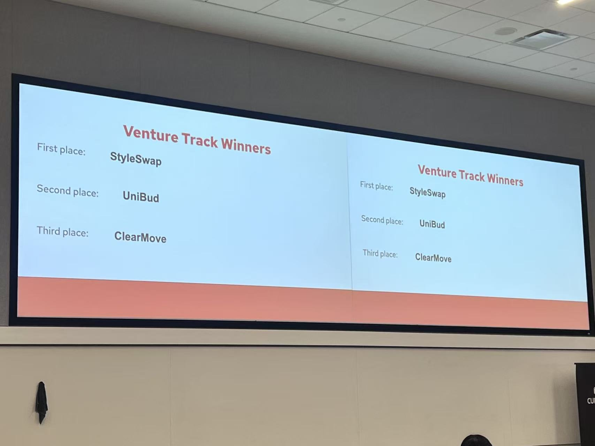

# 🏠 ClearMove - Your ultimate rent consultant

ClearMove – Evidence, not arguments. Secure your wallet. ClearMove protects your rights as a renter by turning your lease, checklists, and move-in/out photos into organized, shareable evidence—so deposit disputes are decided by facts, not fights.

This project was built for **Badger Build Festival 2025** at **UW–Madison**,  
hosted by the **Cursor AI Club** and **Badger Blockchain**, and sponsored by:  
**Cursor AI, Gemini, Strato VC, Kinetic, College.xyz, Turtle, and Cloud Native Madison**.




> Our group won **3rd place out of 92 participants** in the Venture Track and received a **$500 cash prize**.


## 🚀 Quick Start

```bash
# Install dependencies
npm install

# Run development server
npm run dev

# Open the landing page
# http://localhost:3000
```

Then create a `.env.local` file in the project root and add your Gemini API key:

```bash
GOOGLE_GEMINI_API_KEY=your-key-here
```

Restart `npm run dev` after creating or changing `.env.local`.

## ✨ Features

- 📸 **Paper checklist → digital checklist**  
  Upload a photo of your move-in checklist and **Google Gemini** turns it into a clean, editable in‑app checklist.
- 🧩 **Smart category grouping**  
  Items are automatically grouped by room/area (e.g. Kitchen, Living Room, Bedroom) using `[Category]` / `(Category)` tags.
- ✏️ **Inline notes per item**  
  Add notes for every checklist item (e.g. “small scratch on left wall”).
- 📷 **Move‑in & move‑out photo capture**  
  Take camera photos (up to 3 per item per phase) directly from your phone for **move‑in** and **move‑out**.
- ⏱️ **7‑day fairness window**  
  Photos can be edited/replaced only within 7 days after move‑in; move‑out photos are only allowed starting 7 days before the lease end.
- 🕒 **Timestamps on every photo & PDF**  
  Each captured photo stores its timestamp and shows it in the generated PDF report.
- 📄 **Inspection PDF report**  
  Generate a neat PDF grouped by category, with items, notes, and embedded before/after photos.
- 📑 **AI lease advisor tab**  
  Upload your lease PDF and get Gemini-generated insights: key clauses, hidden fees, tenant risks, and questions to ask.
- 💾 **Auto-save in browser**  
  Checklists, photos, and dates are stored client-side in `localStorage` for the demo.
- 🎨 **Landing page + fade transition**  
  A dedicated landing page at `/` with rotating slogan & subtle gradient background, fading into the main app at `/app`.
- 📱 **Mobile-friendly UI**  
  Designed and tested primarily for phone use.

## 🧠 Google Gemini setup (required)

ClearMove uses **Google Gemini 2.5 Flash** for:
- Parsing checklist images into structured items
- Analyzing lease PDFs into human-friendly insights

To run these features:

1. Get a free Gemini API key: https://aistudio.google.com/app/apikey
2. Create `.env.local` in the project root:
   ```bash
   GOOGLE_GEMINI_API_KEY=your-key-here
   ```
3. Restart the dev server: `npm run dev`

The free tier is usually enough for hackathon/demo usage. 🎉

📖 Detailed steps: [GEMINI-API-SETUP.md](./rent-consultant/GEMINI-API-SETUP.md)

## 📚 Documentation

- **[SETUP.md](./rent-consultant/SETUP.md)** - Full setup guide & tech stack
- **[HACKATHON-DEMO.md](./rent-consultant/HACKATHON-DEMO.md)** - Demo script & talking points
- **[GEMINI-API-SETUP.md](./rent-consultant/GEMINI-API-SETUP.md)** - Step-by-step API key guide

## 🎯 The Problem We Solve

Students and renters often **lose their security deposits** due to:
- ❌ No proof of pre-existing damage
- ❌ Missing photos with timestamps
- ❌ Messy paper checklists that get lost
- ❌ Difficulty comparing move-in vs move-out condition
- ❌ Hidden rules and fees in the lease contract

## 💡 Our Solution

A mobile-first web app that:
1. Shows a **clean landing page** explaining the value of evidence-first renting.
2. **Digitizes paper checklists** using Gemini vision and groups items by room/category.
3. Lets renters **capture move-in and move-out photos** per item directly from the camera.
4. **Preserves evidence with timestamps** and enforces fair, time-bound editing windows.
5. Generates a **PDF inspection report** ready to email or share with your landlord.
6. Provides an **AI lease advisor tab** that summarizes rules, flags hidden risks, and suggests questions to ask.

## 🛠️ Tech Stack

- **Next.js 16 (App Router)** - Modern React framework
- **React 19 + TypeScript** - Strongly typed UI
- **Tailwind CSS** - Utility-first styling & animations
- **Google Gemini 2.5 Flash** - Vision & text for checklist + lease analysis
- **pdf-lib** - Client-side PDF report generation
- **pdf-parse** - Lease text extraction from PDFs (API route)
- **localStorage** - Client-side data persistence for the demo

## 📱 Mobile Testing

The app is fully responsive! Test on your phone:

Demo at: https://cleanmove.onrender.com

## 🎬 Demo Flow

1. Open `http://localhost:3000` (landing page), read the slogan, and click **“Get Started →”**.
2. On the **Checklist** tab:
   - Upload a paper checklist photo and let Gemini extract & categorize items.
   - Edit items and add notes as needed.
   - Set your **move‑in** and **move‑out** dates.
   - Take up to 3 photos per item for move‑in, then later for move‑out.
   - Generate a **PDF inspection report** once you’ve captured enough evidence.
3. Switch to the **Lease Advisor** tab:
   - Upload your lease PDF.
   - Read the AI-generated summary, key clauses, hidden fees, tenant risks, and recommended questions.

## 🔮 Future Features

- ☁️ Cloud storage integration
- 🤖 AI-powered damage detection
- 📍 Geolocation & timestamp metadata
- 🏢 Multi-property support
- 🔗 Shareable, read-only web links to inspection reports

## 📊 Market Opportunity

- 🎯 **Target users**: 20M+ college students in US
- 💸 **Average deposit**: $1,000-2,000
- 📉 **Deposit disputes**: 50% of renters face issues
- ⏰ **Time saved**: 2 hours of manual checklist entry

## 🤝 Contributing

This is a hackathon project! Feel free to:
- Report bugs
- Suggest features
- Submit pull requests
- Fork and customize for your needs

## 📄 License

MIT License - feel free to use for your own projects!

## 🙏 Acknowledgments

- Built with [Next.js](https://nextjs.org/)
- AI powered by [Google Gemini](https://ai.google.dev/)
- Styled with [Tailwind CSS](https://tailwindcss.com/)

---

**Built for hackathon. Made with ❤️ for renters everywhere.**

Questions? Check the [documentation](./rent-consultant/) or open an issue!
